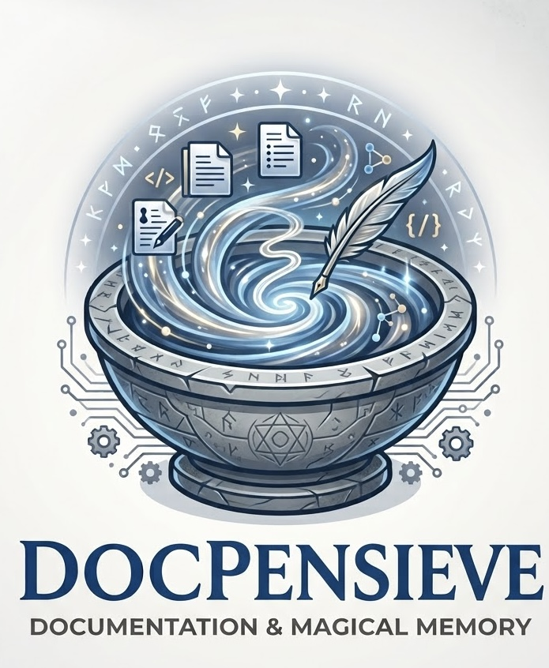

<p align="center">
  
</p>

# DocPensieve

> _Preserve and navigate your documentation memories._

Static documentation site generator: Markdown and MDX in, static HTML out, one
version per orphan branch, JSON-LD structured data generated from the
frontmatter.

Full documentation: <https://docpensieve.com/>

## Principles

- **Nothing to load on the client.** React is used at build time to compile
  MDX; the delivered page is HTML and a stylesheet, without a line of
  JavaScript.
- **No imports in pages.** Eight components are available in any `.mdx`:
  `Card`, `Columns`, `Tooltip`, `Tree`, `Skill`, `TimeTimer`, `LogoIcon` and
  `ScrollToTop`.
- **One version, one branch.** Each compiled version can live on its own
  orphan branch, with a history decoupled from the sources.
- **Tailwind by default, extensible theme.** Templates ask the theme for their
  classes instead of hard-coding them: a provider dresses the whole shell
  without touching a template. A custom theme, without utilities, remains
  available.
- **Nothing fails silently.** An unknown value, a missing parent, a dead link:
  each one stops the build with a message and a hint.

## Requirements

Node.js 22 or later.

## Getting started

```bash
npx docpensieve init my-site
cd my-site
npx docpensieve dev
```

`init` asks for the project name, its URL and the theme, then installs
DocPensieve's documentation in a section of the new site's menu — `--minimal`
leaves it out. The configuration file it writes lists every option, each with a
comment. In a script or in continuous integration, `--yes` accepts the
defaults.

To pin the version a project uses, install it there: `npm init -y` when the
folder has no `package.json` yet, then `npm install docpensieve` and
`npx docpensieve init .`. `npm install` alone creates no site, and in a folder
without a `package.json` it installs in the nearest parent that has one.

| Command                           | Effect                                                   |
| --------------------------------- | -------------------------------------------------------- |
| `npx docpensieve init [folder]`   | sets up a project                                        |
| `npx docpensieve build [version]` | builds every version, or a single one                    |
| `npx docpensieve check`           | reads the produced site back: dead links, invalid markup |
| `npx docpensieve dev`             | builds, serves, watches and reloads                      |
| `npx docpensieve serve`           | serves the output folder                                 |

To update a project that installs it: `npm install docpensieve@latest`. Run
through `npx` alone, it needs nothing: `npx docpensieve` fetches the latest
version by itself.

## Configuration

```javascript
/** @type {import('@docpensieve/core').DocPensieveConfig} */
export default {
  projectName: 'My documentation',
  siteUrl: 'https://docs.example.com',
  versions: [
    { slug: 'beta', name: '1.1 (beta)', folder: 'docs/v1.1', prerelease: true },
    { slug: 'latest', name: '1.0', folder: 'docs/v1.0', current: true },
  ],
  // 'tailwind' (the default, shipped with the tool) or 'custom', the custom theme.
  theme: {
    framework: 'tailwind',
    tokens: { '--dp-accent': '#008060' },
  },
};
```

Every field is described in the [configuration reference](https://docpensieve.com/versions/latest/reference/configuration/).

## Contributing

```bash
git clone https://github.com/Juniors017/docpensieve.git
cd docpensieve
npm install
npm run check            # format, types, lint, tests — before every commit
```

In this repository, `npm run build`, `npm run dev` and `npm run serve` work on
the project's own documentation.

```
docpensieve/
├── docs/v0.1/                archived version
├── docs/v0.2/                current version
├── docs/v0.3/                version in preparation
├── packages/
│   ├── shared/               constants, errors, slugs
│   ├── core/                 config, loader, compiler, JSON-LD, generator
│   ├── theme/                CSS providers
│   ├── components/           MDX components
│   └── cli/                  init / build / check / dev / serve commands
├── docpensieve.config.js
└── dist/                     generated output (not versioned)
```

The dependency graph never goes up: `shared` ← `core` / `theme` /
`components` ← `cli`. The engine receives theme and components by injection,
which makes it testable without React or CSS.

A component works under both themes, and its page shows its styling in the
terms of each: an example about the look comes in a
`<ForTheme framework="tailwind">` and a `<ForTheme framework="custom">`
variant, and every class of the latter is defined in `docs/v<x.y>/examples.css`,
which `init` installs as `theme/99-docpensieve.css`. The end-to-end test builds
a site under each theme and fails on any example class that no rule styles.

## License

MIT
